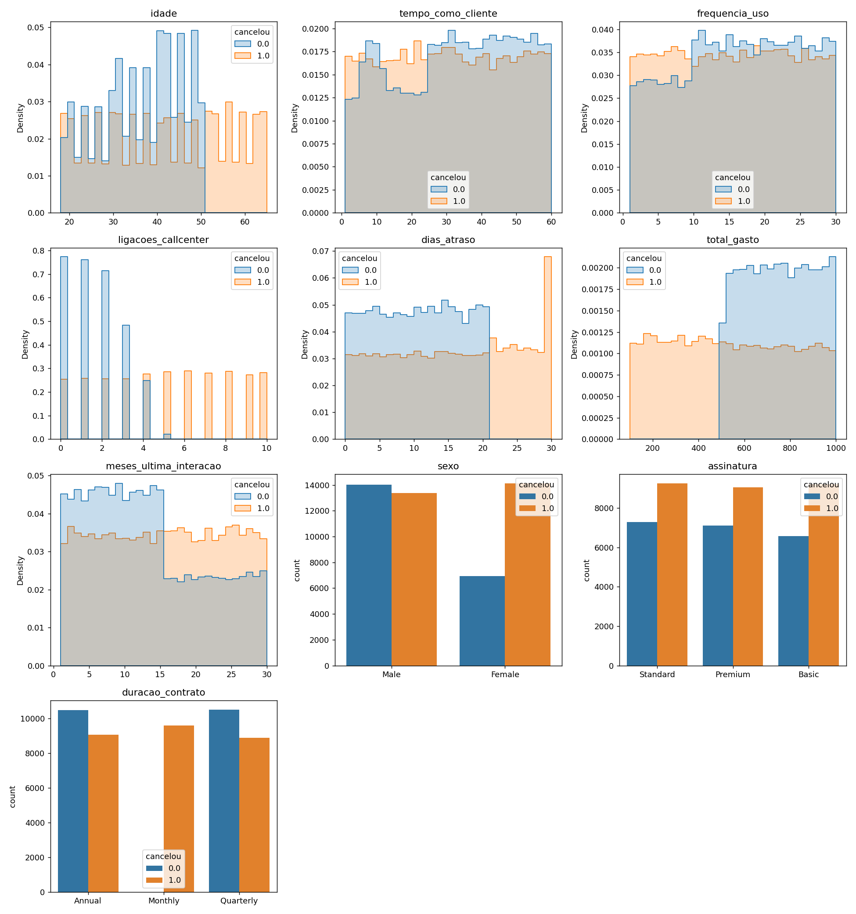
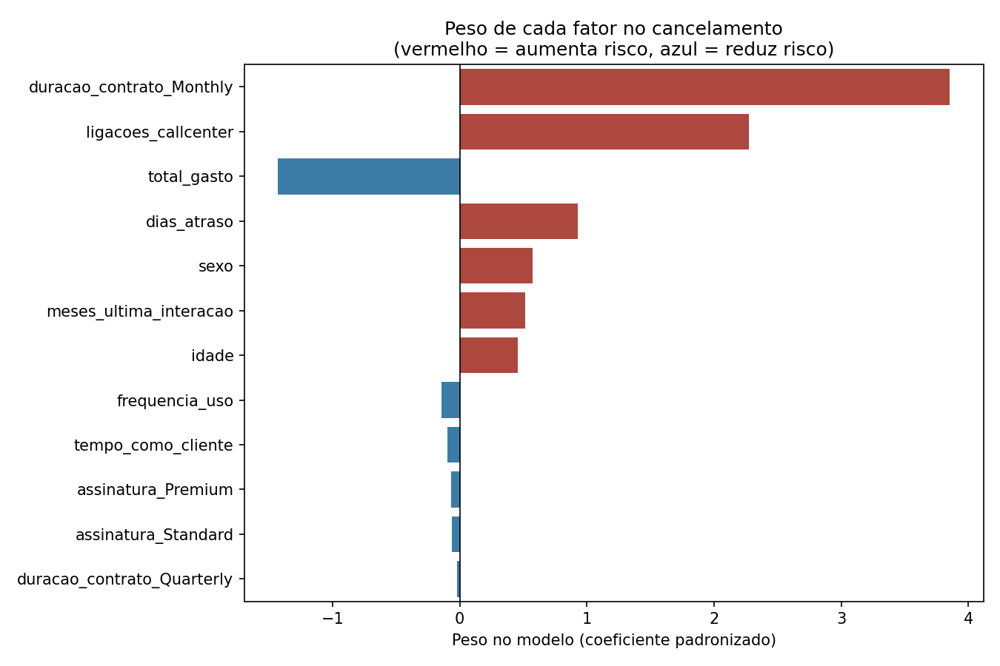
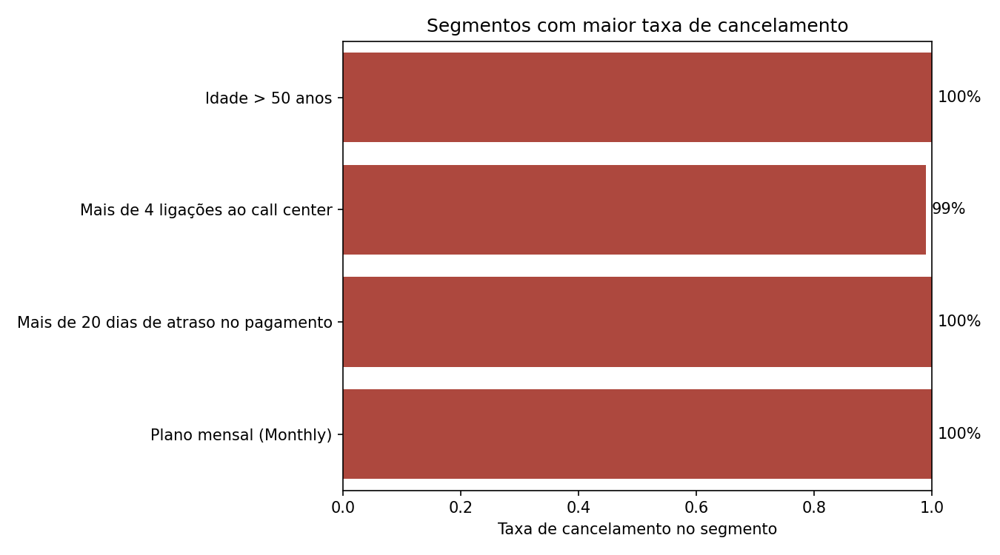
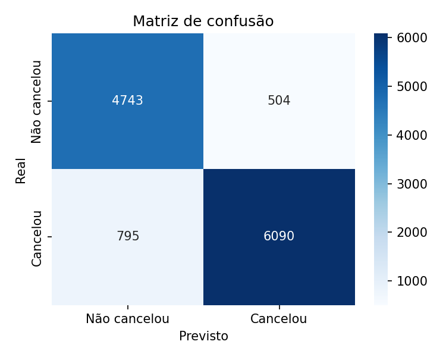

# Análise de Cancelamento de Clientes (Churn)

Análise exploratória e modelagem preditiva para identificar os principais
fatores associados ao cancelamento de clientes em uma base de +50 mil
registros, com o objetivo de orientar ações de retenção.

## O problema

Uma empresa com mais de 800 mil clientes percebeu que a maior parte da sua
base é composta por clientes inativos — que já cancelaram o serviço. Antes de
qualquer ação de retenção, era preciso responder duas perguntas:

1. **Quais fatores** estão mais associados ao cancelamento?
2. **Qual o peso relativo** de cada um desses fatores, isoladamente dos
   demais?

## Abordagem

O projeto segue cinco etapas, documentadas passo a passo no notebook:

1. **Diagnóstico e limpeza da base** — remoção de identificador irrelevante,
   verificação de valores nulos e, principalmente, de **linhas duplicadas**
   (1.469 registros duplicados foram identificados e removidos — uma
   verificação que muitas análises exploratórias pulam, mas que distorce
   qualquer estatística calculada depois).
2. **Análise exploratória geral** — distribuição do cancelamento por variável,
   em um grid único (Matplotlib/Seaborn), leve e visível diretamente no
   GitHub.
3. **Identificação de segmentos de risco** — quatro variáveis concentram
   cancelamento próximo de 100%: idade acima de 50 anos, mais de 4 ligações
   ao call center, mais de 20 dias de atraso no pagamento, e plano mensal.
4. **Modelagem preditiva** — uma regressão logística foi treinada para
   quantificar o peso de cada fator de forma estatisticamente controlada
   (não apenas correlação isolada), com avaliação por acurácia, precisão,
   recall e matriz de confusão.
5. **Conclusões e recomendações de negócio** — tradução dos achados técnicos
   em ações práticas de retenção.

### Uma decisão consciente de modelagem

Uma abordagem ingênua seria filtrar os clientes dos segmentos de risco para
fora da base e apontar que "a taxa de cancelamento caiu" — mas isso é um erro
estatístico: remover as linhas que cancelaram não reduz cancelamento real,
apenas tira essas linhas da análise. Este projeto trata esses segmentos como
**sinais de alerta para priorização de ações**, não como uma solução por
exclusão de dados.

## Resultados

O modelo de regressão logística atingiu **89% de acurácia** no conjunto de
teste (92% de precisão e 88% de recall para a classe "cancelou"), validando
estatisticamente os padrões identificados na análise exploratória.

### Distribuição geral das variáveis



**Fatores que mais aumentam o risco de cancelamento** (por peso no modelo):



1. Plano de contrato mensal (vs. anual/trimestral)
2. Número de ligações ao call center
3. Dias de atraso no pagamento
4. Idade e tempo desde a última interação

**Fator que reduz o risco:** total gasto acumulado — clientes mais engajados
financeiramente tendem a permanecer.

### Segmentos de maior risco identificados na análise exploratória



### Avaliação do modelo



## Recomendações de negócio

- Incentivar migração de planos mensais para anuais/trimestrais (desconto
  progressivo).
- Atendimento prioritário para clientes a partir da 3ª ligação ao call
  center, antes de chegarem à 4ª.
- Negociação proativa da equipe financeira a partir de ~15 dias de atraso.
- Usar o modelo como *score de risco* contínuo para priorizar campanhas de
  retenção, em vez de regras fixas de corte.

## Como rodar o projeto

```bash
# Clonar o repositório
git clone https://github.com/pedro-caputo/analise-cancelamento-clientes.git
cd analise-cancelamento-clientes

# Criar e ativar um ambiente virtual (opcional, mas recomendado)
python -m venv venv
venv\Scripts\activate     # Windows
source venv/bin/activate  # Linux/Mac

# Instalar dependências
pip install -r requirements.txt

# Abrir o notebook
jupyter notebook notebook/analise_cancelamento.ipynb
```

## Estrutura do repositório

```
analise-cancelamento-clientes/
├── dados/
│   └── cancelamentos.csv
├── notebook/
│   └── analise_cancelamento.ipynb
├── imagens/
│   ├── segmentos_risco.png
│   ├── peso_fatores.png
│   └── matriz_confusao.png
├── requirements.txt
├── .gitignore
├── LICENSE
└── README.md
```

## Tecnologias utilizadas

- Python
- Pandas
- Matplotlib / Seaborn (visualização)
- Scikit-learn (regressão logística)

## Contexto

Projeto desenvolvido a partir do case "Cancelamento de Clientes" da Jornada
Python (Hashtag Treinamentos), refeito com foco em qualidade de análise,
correção estatística das conclusões e modelagem preditiva além do escopo
original do curso.

## Autor

**Pedro Henrique Caputo**
[LinkedIn](#) · [GitHub](https://github.com/pedro-caputo)

## Licença

Este projeto está sob a licença MIT — veja o arquivo [LICENSE](LICENSE) para
mais detalhes.
